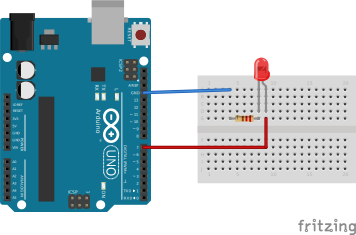

### Hello World Led - Project 001

Maybe on of the easiest circuits to do - turning on and off a LED with Arduino.

### Used:
* Arduino
* Resistor 220 Ohm
* LED

### Circuit

https://user-images.githubusercontent.com/49988070/177171988-acd55887-df3c-4ae5-ba90-e745da0bef5a.mp4
