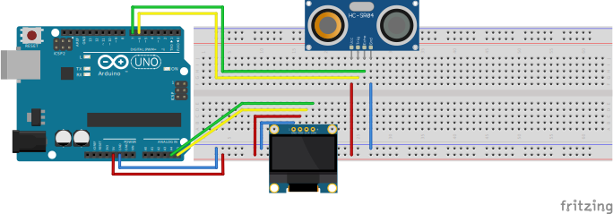
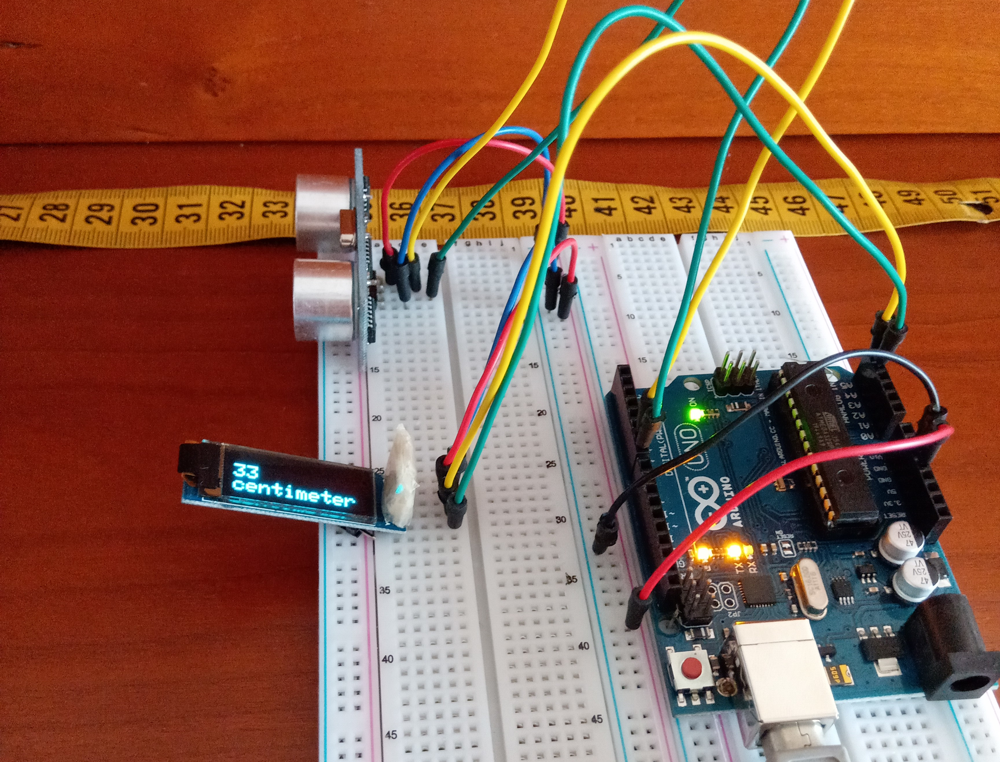

### Measuring with a Sonar - Project 002

Measuring a distance with a SONAR and showing it on an OLED Dispay.

### Used:
* Arduino
* HC-SR04 (Ultrasonic Distance Sonar)
* OLED I2C Display 0.91' - 128x32 px

### Circuit

	
	

https://user-images.githubusercontent.com/49988070/177580234-1c5c7c5b-e5bc-4b4b-9fd6-863142908069.mp4

