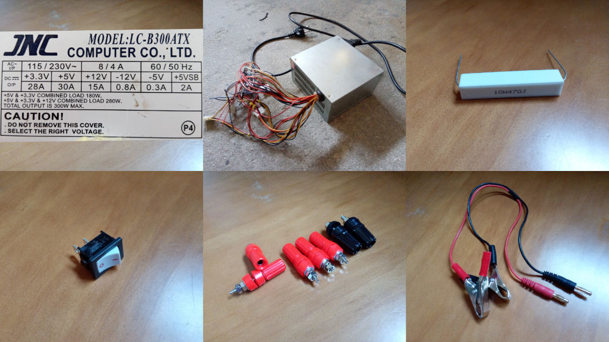
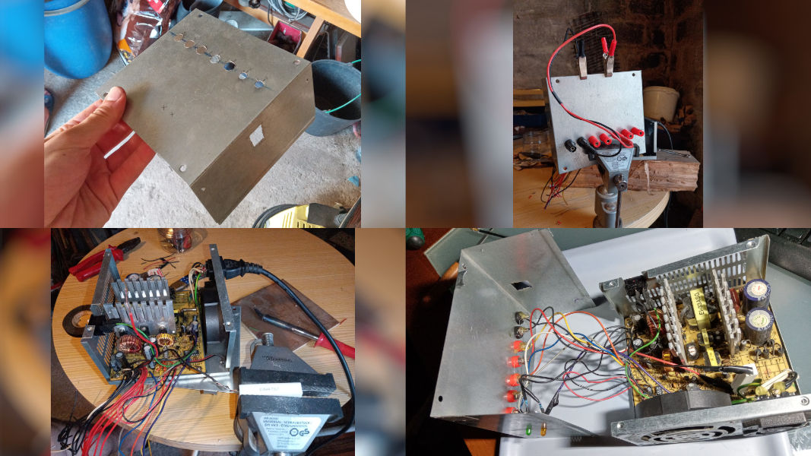
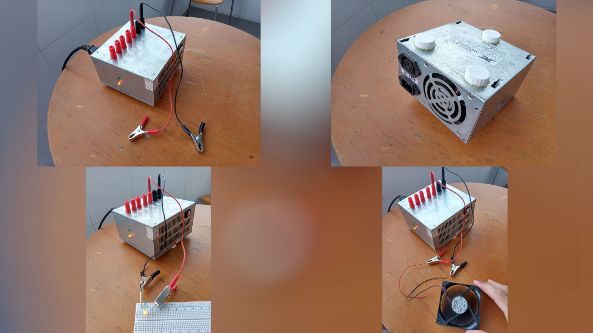

### Bench Power Supply (DIY) - Project 003

In this project I created a bench power supply to use in  my future projects. With it I can get 24V, much more than the Arduino's 5 volts. For this was used a computer PSU, that can provide -12V, -5V, 3.3V, 5V and 12V.

An advantage of use a PSU is its security, since it needs protect the computer, it will also protect our circuits; for example, on a short circuit, it will automatically turns off without any damage.

### Used:

* Computer PSU
* Resistance - 10W 47Ω
* Switch
* Female Banana Plugs (5 red + 2 black)
* Cable (with Male Banana Plug)

### How to do it?

All the process was based on a [video](https://www.youtube.com/watch?v=2Ou7MOVZeo4) of a brazilian YouTube Channel, [Manual do Mundo](https://www.youtube.com/c/manualdomundo). A possible english version would be this [blog post](https://www.instructables.com/A-Makers-Guide-to-ATX-Power-Supplies/).

But in short:

1. Open the Female Banana Plugs and switch holes on the PSU's carcass.
2. Connect the Banana Plugs to the respective voltage (follow [this](https://content.instructables.com/ORIG/F2M/DMYY/HA4MG4QW/F2MDMYYHA4MG4QW.jpg?auto=webp&frame=1&width=1024&height=1024&fit=bounds&md=379dbc3ede0769060e122de92a89886e) caption)
3. Weld the the resistance on 5V, and the switch and LEDs (standby and on) on the respective cable (green, purple and grey respectively).

### The Final Product

At the final we have a awesome Bench Power Supply, that can provide a maximum of 24 volts to power our next circuits. It's cheap, it's house made and it's one more project.

###### Note: This PSU can supply: 3.3V, 5V, 12V, 8.3V, 10V, 17V, 15.3V, 17V, 24V

