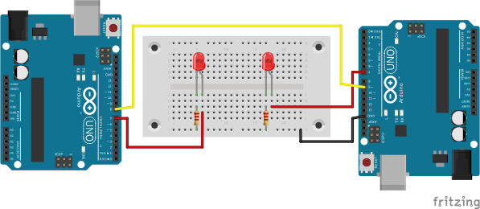

### Hello Parallel World Led - Project 004

Taking the Hello World Led Project to another level.
The 2 Arduinos are talking to just one of the two LEDs be turned on.
Each Arduino controls one LED.

### Used:
* 2x Arduino
* 2x Resistor 220 Ohm
* 2x LED

### Circuit

https://github.com/Darguima/arduino-projects/assets/49988070/59156571-049e-4782-b4d7-6957699f5c12
