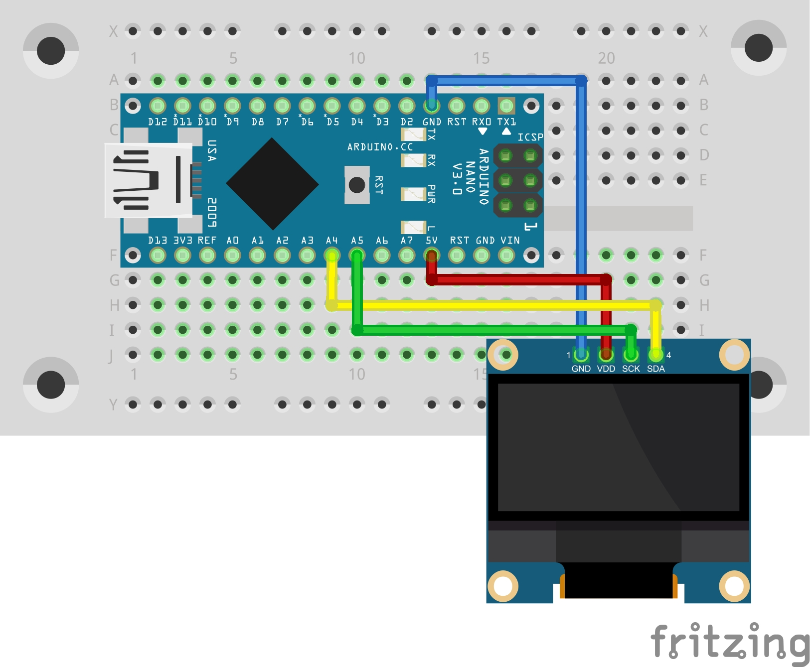

### 0.91 inches OLed - Project 005

To try my OLed Screen and learn about Adafruit GFX library, while trying my new unofficial Arduino Nano, I developed a simple sliding text (not available at the library) on this project.

### Used:
* 1x Arduino (Nano on my case)
* OLED I2C Display 0.91' - 128x32 px

### Circuit

https://github.com/Darguima/arduino-projects/assets/49988070/0de7b90d-16f9-442b-91c9-739336e7db13
