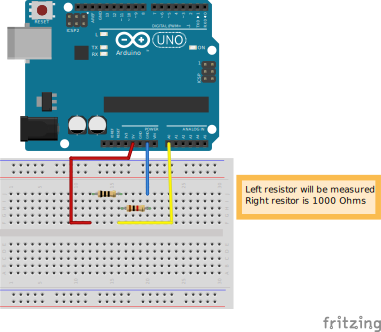

### Measuring Resistances - Project 006

While planing a future Arduino MIDI project, I end up with the need to "emulate" a potentiometer (that I currently don't have). But before create my manual potentiometer (that I except be the next project here) I realized that I need to can measure the resistance from any circuit. So, with the help of a blog post, I end up with this.

### Used:
* 1x Arduino
* 1K Ohm resistance
* Resistors that you want to measure

### Circuit

https://github.com/Darguima/arduino-projects/assets/49988070/298f3601-a464-4803-a8ab-82e09709e1fd
