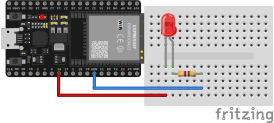

### ESP 32 LEDs and Touch Sensor - Project 007

Just received my ESP32 and I'm trying it basics features like turn on a LED and detect touch on Pins.

### Used:
* 1x ESP 32
* 470K Ohm resistor
* LED

### Circuit

https://github.com/Darguima/arduino-projects/assets/49988070/16b0be9b-50b2-4e41-83af-b8dd15df8771
