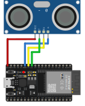
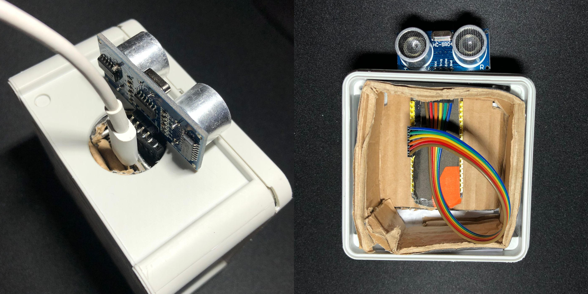

### ESP 32 WiFi and Sonar - Project 008

Detecting if a door is open with ESP32 and exposing it to the Internet over an HTTP site hosted on the ESP32.

### Used:
* 1x ESP 32
* HC-SR04 (Ultrasonic Distance Sonar)

### Requirements

You need to compile the `.html` files to `.h` files to include them in the ESP32 code.

#### VSCode Arduino Extensions

Add this line to your `.vscode/arduino.json` (VSCode configuration file for Arduino CLI) to compile the headers files for all the HTML pages before each upload:

```
{
    "prebuild": "./convert_html_to_h.sh"
}
```

#### Manual Compilation

Or simply run each time you edit the pages HTML

```
./convert_html_to_h.sh
```

### Circuit



#### Case



https://github.com/Darguima/arduino-projects/assets/49988070/4ae16f2f-609c-4fe7-b55a-51160a2d39c4
