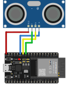

### ESP 32 WiFi and Sonar - Project 008

Detecting if a door is opened with ESP32 and exposing it to the Internet.

### Used:
* 1x ESP 32
* HC-SR04 (Ultrasonic Distance Sonar)

### Requirements

Add this line to your `.vscode/arduino.json` (VSCode configuration file for Arduino CLI) to compile the headers files for all the HTML pages before each upload:

```
{
    "prebuild": "./convert_html_to_h.sh"
}
```

Or simply run each time you edit the pages HTML

```
./convert_html_to_h.sh
```

### Circuit


