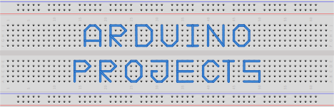

<h1 align="center">
	
</h1>

<h2 align="center">
	Arduino Projects
</h2>

Welcome to <u>Arduino Projects</u>, the place where I store all my electronic circuits, with Arduino, Raspberry Pi or even root electronic, without any microcontroller.

### Projects 📚

In this section you have a complete list of everything I've ever done. Try to choose one of them, read the project documentation, watch the simulation and try it for yourself.

___

6\. [Measuring Resistances](https://github.com/Darguima/arduino-projects/tree/master/006_measuring_resistances)

5\. [0.91 inches OLed](https://github.com/Darguima/arduino-projects/tree/master/005_91_centiinch_oled)

4\. [Communication between arduinos](https://github.com/Darguima/arduino-projects/tree/master/004_communication_between_arduinos)

3\. [Bench Power Supply (DIY)](https://github.com/Darguima/arduino-projects/tree/master/003_bench_power_supply_DIY)

2\. [Measuring with a Sonar](https://github.com/Darguima/arduino-projects/tree/master/002_measuring_with_a_sonar)

1\. [Hello World Led](https://github.com/Darguima/arduino-projects/tree/master/001_hello_world_led)

___

### Why I created this repository

You can find many blogs about Arduino and electronics on the Internet, teaching you how to use all sorts of modules or components. The idea here is not to teach anyone, it's just to have a place to document and store my projects, with images and the code.
